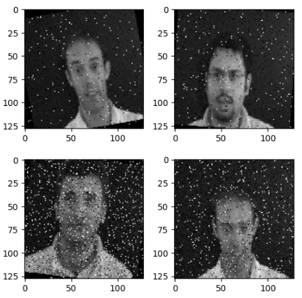
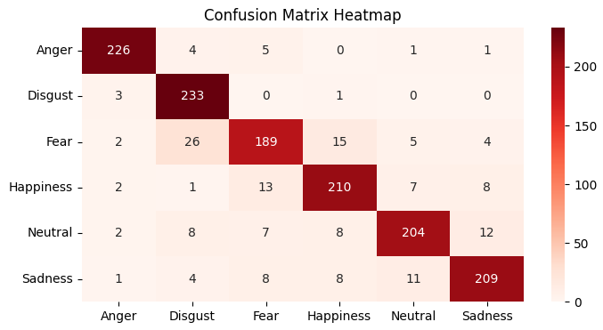

# Emotion Recognition
## _Image Classification using CNN's_

For a final project in a course on deep learning, I train convolutional neural networks to classify the emotions depicted in frontal face images. In this sample of 11,000+ images, each was be labelled as depicting either anger, disgust, fear, happiness, neutral, or sadness.

[Please find my analysis and modelling here](Emotion_Recognition.ipynb), which I performed in Google Colab.

  
### Some visuals from this project:

  

| **Visualized Samples** |
| :--: |
| 

 |
| *Some visualized samples from this image dataset.* |

  
| **Training History Plot** |
| :--: |
| 

 |
| *A plot of a model's accuracy and loss in training and validation. Plots like these were examined to check for overfitting.* |

  
| **Confusion Matrix** |
| :--: |
| 

 |
| *To strengthen my sense of a classifier's error, I examine the confusion matrix of its test performance.* |

